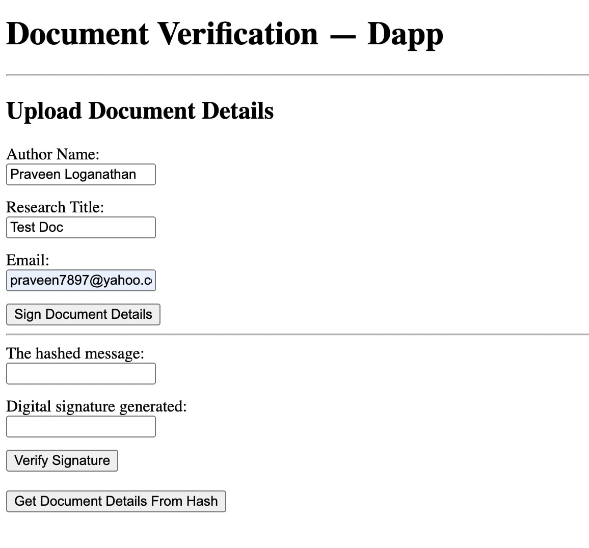
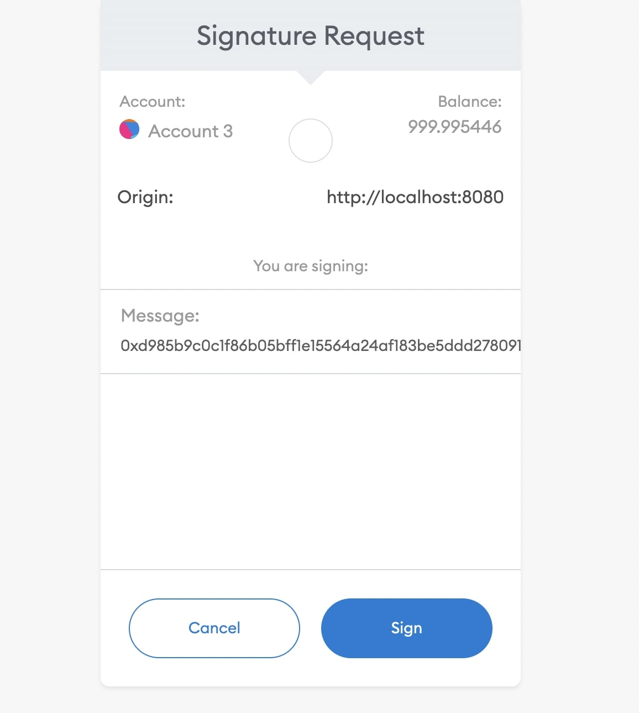
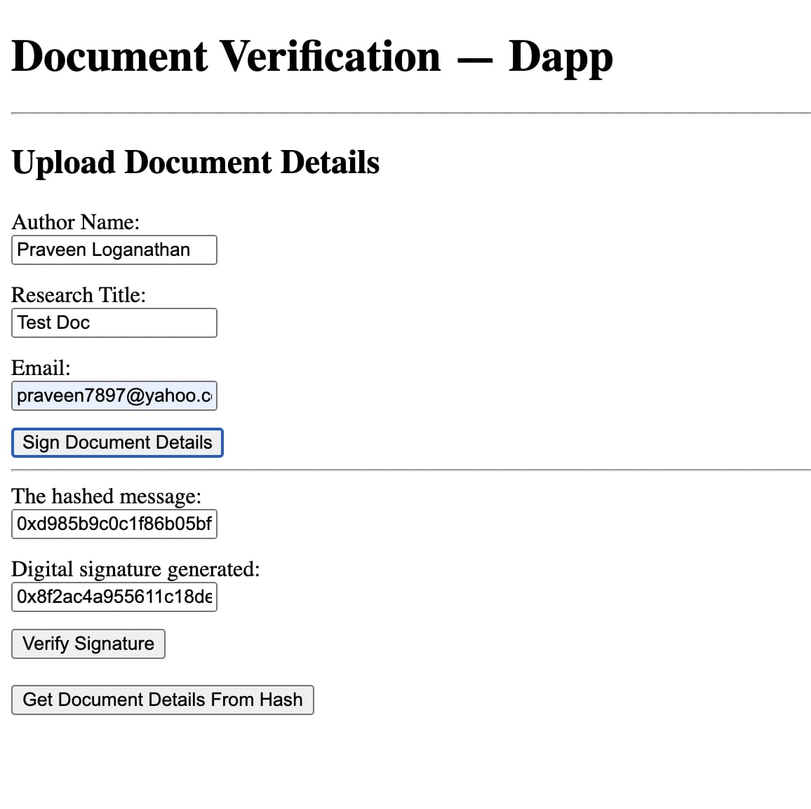
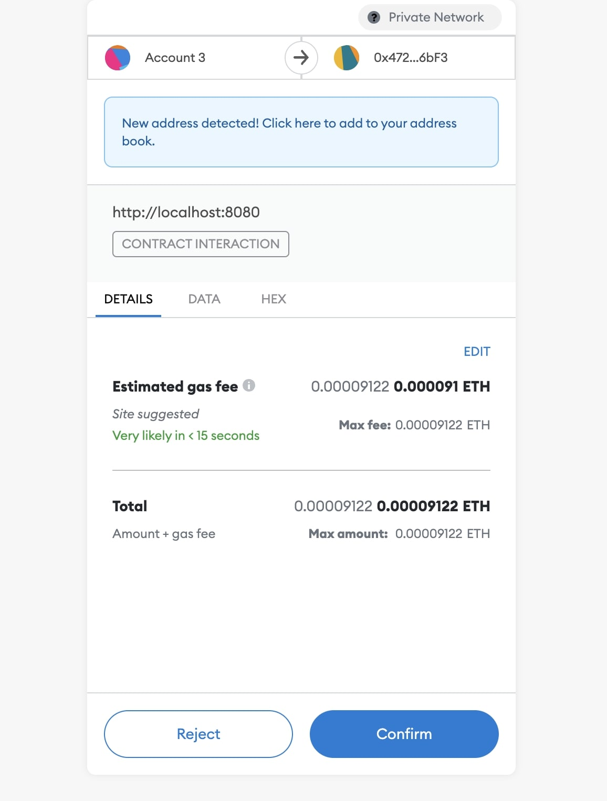
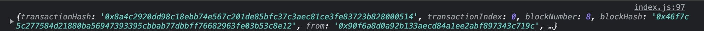
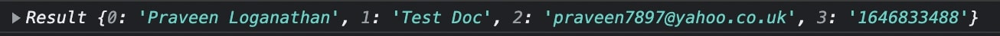

**Project: Document Verification DApp**

This repository contains an Ethereum DApp that demonstrates a document verification system.

To simulate uploading an actual document, this app will use some document details given as input by the user.

A researcher can hash and digitally sign a document and then add this information to a smart contract. Peers can retrieve the hash and digital signature from the smart contract and use it to decode the researcher's digital identity to verify who had signed it.

Versions:

1. Truffle v5.5.3
2. Ganache v8.3.1
3. Metamask v10.10.2
4. Node Js v16.14.0

Screenshots of DApp GUI:

### Enter Document Details


### Hash and Sign Document Details


### Hashed Details Output


### Verify Signature


### Signer Address Console Output


### Document Details Console Output


Instructions on how to migrate the contract and import test accounts from Ganache can be found below.

## Getting Started

These instructions will get you a copy of the project up and running on your local machine for development and testing purposes.

## Prerequisites

Please make sure you've already installed Ganache, Truffle, Node Js and enabled MetaMask extension in your browser.

Open MetaMask Settings/ Networks and add a private network with New RPC URL and Chain ID that matches Ganache's settings.

## Installing

A step by step series of examples that tell you have to get a development env running.

Clone this repository:

```
git clone <https://github.com/PraveenLoganathan/Updated-Document-Verification>
```

Change directory to ```DocumentVerification``` folder and install all requisite npm packages (as listed in ```package.json```):

```
cd DocumentVerification
npm init
```

In a separate terminal window, launch and compile smart contracts:

```
cd DocumentVerification
truffle develop
truffle compile
```

This will create the smart contract artifacts in folder ```build\contracts```.

In a separate terminal window, cd into DocumentVerification and launch Ganache:

```
ganache
```
Migrate smart contracts to development network. This will migrate the contract to Ganache.

```
truffle migrate --network development
```
Once the contract has migrated, close down Truffle window.

In a separate terminal window, launch the DApp:

```
cd DocumentVerification
cd app
npm run dev
```

On MetaMask, import a private key from the list of private keys generated by Ganache.
